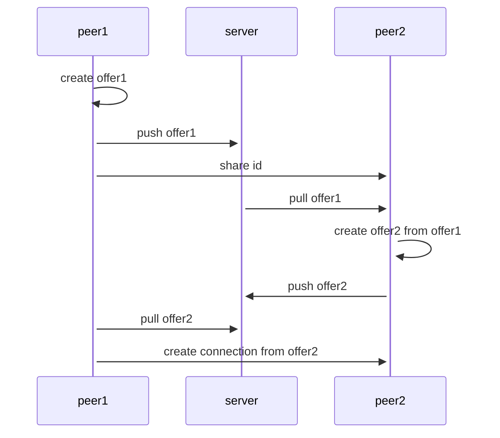

# dev

```bash
npm i
npm start
```

## Example in JS
https://github.com/hnasr/javascript_playground/tree/master/webrtc



## summary

A wants to connect to B
A creates an "offer", it finds all ICE candidates, security options, audio/video options and generates SDP, the offer is basically the SDP
A signals the offer somehow to B (server todo)
B creates the "answer" after setting A's offer
B signals the "answer" to A


## bookmarks
https://www.html5rocks.com/en/tutorials/webrtc/basics/#toc-disruptive
https://rustwasm.github.io/wasm-bindgen/examples/webrtc_datachannel.html